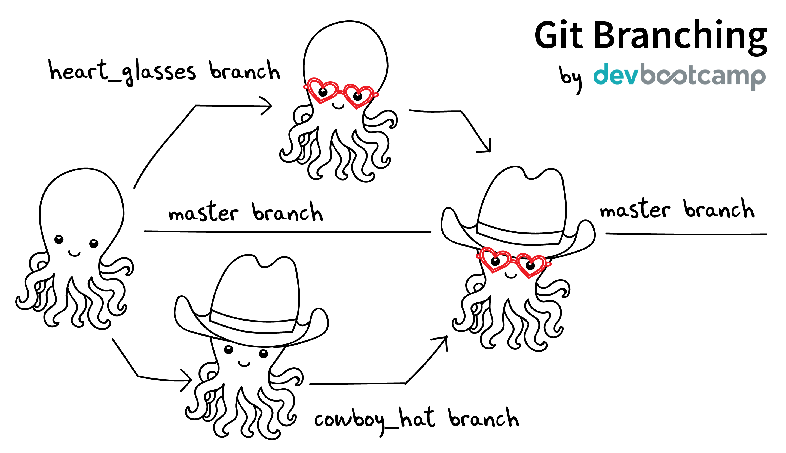

# What is Git?

# Distributed / decentralised

very easy branching

# Branching

# Commit access

open source

# https://try.github.io/

$ mkdir repo
$ cd repo

initialize a Git repository

$ git init

The .git directory
On the left you'll notice a .git directory. It's usually hidden.
If you click it you'll notice it has all sorts of directories and files inside it. You'll rarely ever need to do anything inside here but it's the guts of Git, where all the magic happens.

$ git status

It's healthy to run git status often. Sometimes things change and you don't notice it.

$ touch cat.js
$ git status

staged:
Files are ready to be committed.

unstaged:
Files with changes that have not been prepared to be committed.

untracked:
Files aren't tracked by Git yet. This usually indicates a newly created file.

deleted:
File has been deleted and is waiting to be removed from Git.

$ git add cat.js

Staging Area:
A place where we can group files together before we "commit" them to Git.

$ git add -A .

add all:
You can also type git add -A . where the dot stands for the current directory, so everything in and beneath it is added. The -A ensures even file deletions are included.

### git reset

$ echo 'moo' > wrong

$ git add wrong
$ git status

You can unstage files by using the git reset command.

$ git reset wrong

### git checkout

$ echo 'wrong change' >> good

Files can be changed back to how they were at the last commit by using the command: git checkout <target>. Go ahead and get rid of all the changes since the last commit for 'good'

$ cat good
$ git checkout good
$ cat good

### interactive staging

### branching

$ git checkout -b clean_up // branch of current branch
$ git rm good
$ git add -A .
$ git commit -m "clean up"

$ git checkout master
$ git merge clean_up

$ git branch -D clean_up
$ git push

# set upstream

One way to avoid having to explicitly do --set-upstream is to use the shorthand flag -u along-with the very first git push as follows:

git push -u origin local-branch

This sets the upstream association for any future push/pull attempts automatically.

config

bash_profile
